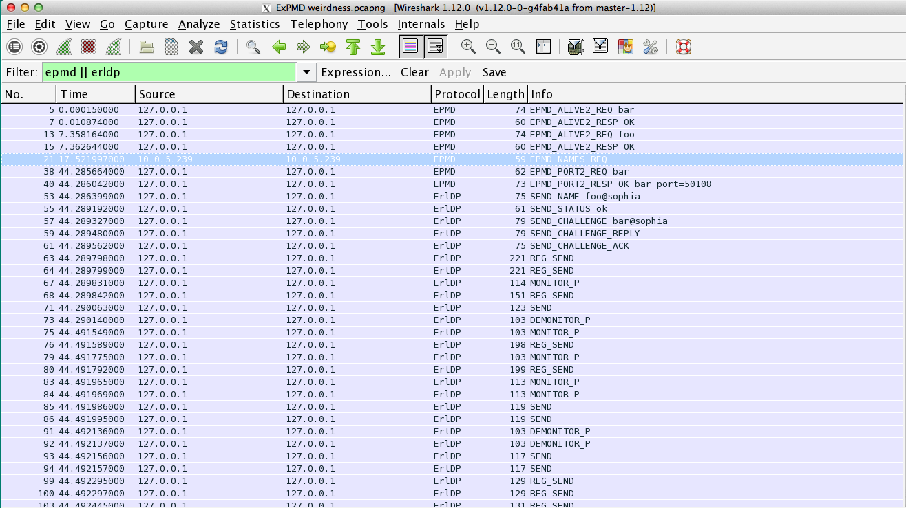

# Day 24 at Hacker School
## I start learning Elixir.

-----

After a brief hiatus, I'm back. Three weeks ago, I started work on a [bittorrent client in Python](https://github.com/sophiadavis/bittorrent-client) and two weeks ago, I wasted the entire week being stuck because bittorrent peers were smushing multiple messages into one packet (haters). So, I decided to take a sabbatical from the pain of bittorrent, and started learning [Elixir](http://elixir-lang.org/) instead. Given that José Valim, the creator of Elixir, was spending two weeks at Hacker School as a resident, it seemed like a timely thing to do. It's a pretty cool experience to be stuck on a stupid syntax error, and suddenly the creator of the language that you're struggling with comes over and offers to help.   

One of my first projects in Elixir (accomplished through lots of pairing sessions with José) was to write a replacement EPMD. EPMD stands for Erlang Port Mapper Daemon (not to be confused with the [NYC-based rap group](http://en.wikipedia.org/wiki/EPMD)). It's a TCP server, written in C, that ships with Erlang. Its job is to store information about all nodes registered on its local network (a node is just an operating system process running the Erlang VM). So when any node wants to find out how to contact another node, it just hits the EPMD up for that information.   

Why is this cool? Well, distributed systems are cool and powerful, but they're also complicated. In order to set up a distributed system, you need to be able to coordinate actions, data, etc. between all the different components. Most basically, there needs to be communication between the pieces in the system. In order for the pieces to communicate, the first step is that they need to be able to find each other -- and that's the job of the EPMD. 

The built-in EPMD usually runs on port 4369, and operates using a binary protocol. So if someone else runs a tcp server on port 4369 and parses requests and sends responses according to the EPMD's binary protocol, then they’ve just replaced Erlang’s built-in EPMD. That's exactly what I did.  


The replacement [ExPMD](https://github.com/sophiadavis/expmd) handles 3 requests, as specified by the [EPMD distribution protocol](http://www.erlang.org/doc/apps/erts/erl_dist_protocol.html ):  

1. Alive Request  
This message is sent by a new node when it starts up (ex: ```Node.start(:foo, :shortnames)``` or ```iex --sname foo```), and signals the local EPMD to register the name of the node, the port it’s running on, and some other information. This connection remains open until the node finally exits, at which point the EPMD discards information pertaining to this node.

2. Port request  
One node sends the name of a second node to the EPMD, and the EPMD responds with the port on which the second node is running (ex: ```Node.ping :"foo@machine"``).  

3. Names request  
Executed when a node requests information about all nodes currently registered with its local EPMD (ex: ```:net_adm.names```). The EPMD sends the node a list containing names and ports of all registered nodes.    
 
This is it. The EPMD doesn’t do any coordinating between nodes or sending messages between nodes, it’s all about just helping them find each other.  


------

Here's a wireshark capture to help explain what's going on:  
 

The first 4 packets (5, 7, 13, and 15) are alive requests and responses -- nodes named 'bar' and 'foo' are starting up and registering with the ExPMD, which then knows about both 'foo' and 'bar', what ports they are on, etc. In packet number 38, 'foo' sends a port request, asking for information about node 'bar,' and the ExPMD responds with the port where 'bar' is running. So now 'foo' knows how to contact 'bar' -- and after that no more packets are sent using EPMD protocol. The nodes are communicating directly to each other using some other protocol (ERLDP? What is this "SEND_CHALLENGE" nonsense anyway?)

ExPMD can also connect nodes located on different machines, which can be used for fun stunts like running programs or executing operating system commands on other people's computers (once two nodes are connected, anything is possible). For more info, see the [README](https://github.com/sophiadavis/expmd). 


-----


I will re-attack the bittorrent client next week, with emotional support from my friends in the newly-formed Hacker School Bittorrent Client Support Group (meetings are Monday and Wednesday mornings).

