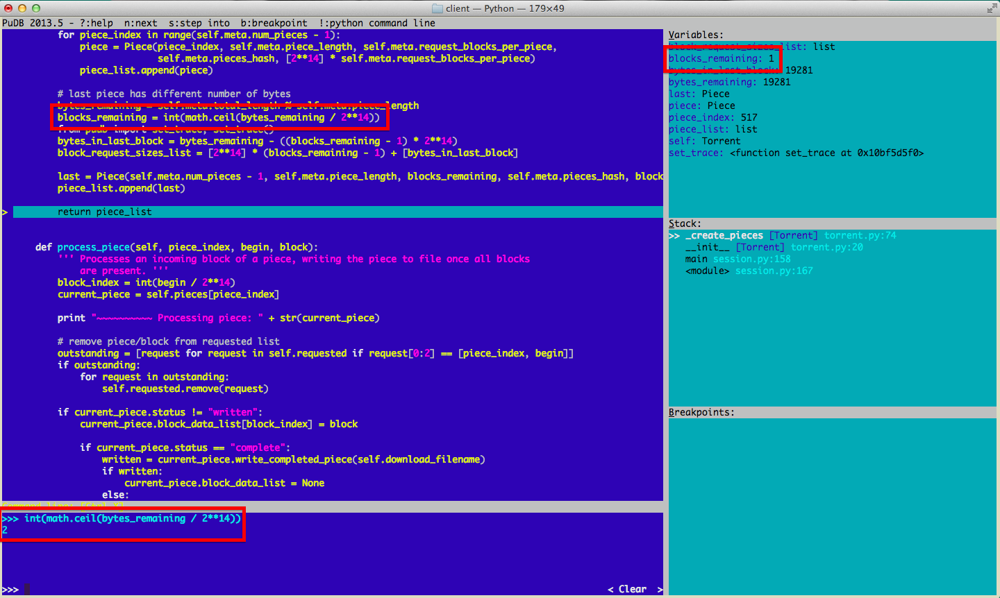

# Day 24 at Hacker School
## I finally wrap up my BitTorrent Client.

-----

I've been working on this thing for three weeks (not counting a much-needed hiatus last week), and I'm proud to say I finally have a [program](https://github.com/sophiadavis/bittorrent-client) that can successfully torrent single and multi-file downloads, given a torrent metainfo file describing the download. So far, I've downloaded Walden, a collection of Voltaire's works, Treasure Island, and a picture of a flag from Hacker School facilitator Tom Ballinger's very own tracker. I feel very cultured. The sketchiest part of this project is definitely downloading the metainfo files themselves...

If you too want to have some BitTorrent fun, I suggest you start with [Kristen Widman's two-part blog post](http://www.kristenwidman.com/blog/how-to-write-a-bittorrent-client-part-1/). I basically followed her instructions step-by-step (except I used the UDP protocol to communicate with trackers instead of HTTP, because I wanted to see how UDP worked!). SO helpful.

Frustratingly, I don't feel like this project significantly increased my understanding of networking or other specific programming concepts. However, it definitely gave me valuable practice structuring a not-insignificant program, and I debunked some very erroneous assumptions I had.  

I wasted several hours (sometimes days, embarrassingly) on each of the discoveries below:  

1. Not every number that looks like decimal is decimal.  
Just because hex numbers can have letters in them doesn't mean they always do.  
2. A packet may not be a complete unit.  
It may be the smallest complete unit of data transfer on the socket level, but a packet probably won't correspond directly to a complete meaningful unit of a data-exchange protocol. In BitTorrent protocol, one packet may contain many messages, or one message may span multiple packets, but each message begins with a header containing the total length of the message. This type of information is important, as it enables you to easily parse incoming data.       
3. Sometimes the debugger lies (aka Sometimes there is no God.)  

This is a screenshot of the lovely interface of the Python visual debugger [PUDB](https://pypi.python.org/pypi/pudb), which I used for the first time while working on this project. The upper left block of the screen shows the part of the file that is currently being executed, the upper right pane shows the value/type of all currently defined variables, and the lower left section is an interactive Python interpreter. It's a very helpful tool and saved me a lot of time and really helped me debug more efficietly (conditional breakpoints are awesome!). Except this one time... I've outlined the disturbing sections in blood-orange. In the top right, I've defined a variable `blocks_remaining = int(math.ceil(bytes_remaining / 2**14))`, in the upper right, we can see that it's current value is 1, but when I run `int(math.ceil(bytes_remaining / 2**14))` in the Python interpreter (bottom left), the expression returns 2. This may be because the PUDB interpreter is using division as defined by the [Future library](https://docs.python.org/2/library/__future__.html), but the program itself is being executed using division from the standard library. Confusing.   
4. If you're trying to write things to file, it's good to delete the files in between attempts.  
Nuff said. I can't believe how much time a poor choice of 'append' mode cost me. 
5. Sometimes, your program doesn't perform correctly -- and it's not due to bugs in your code.  
Usually, it is your fault, but not always -- especially when you're cooperating with external programs. I spent several hours refactoring the function that calculated which piece of the download to request next because I thought it was broken. It turned out that no active peer BitTorrent clients were online -- of course I couldn't successfully download any pieces from non-existant peers no matter what order I requested them in! I guess Walden isn't a very popular torrent.

Anyways, hopefully I won't make these mistakes again. I guess I learned some stuff, but I'm glad it's over. 