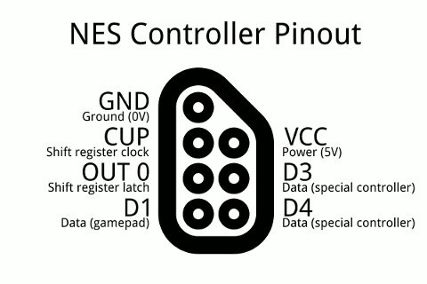
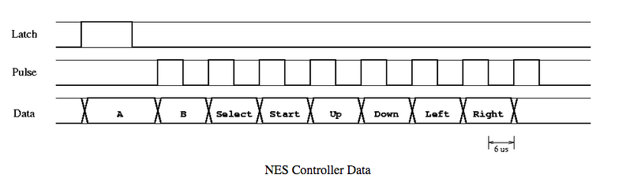

# Day 35 at Hacker School
## Hacking a Nintendo.

--------

This week I've been taking a break from writing code and have joined fellow Hacker Schoolers T and Jonathan in hacking a Nintendo (aka NES -- Nintendo Entertainment System). 

There are two main goals at this stage:  
  
1.  Determine which game cartridge is plugged into the Nintendo
2.  Use an Arduino to simulate pressing buttons on a Nintendo controller

An eventual goal is to be able to record a player's actions and use the Arduino + NES + game cartridge to playback that sequence of actions.

--------

I've discovered that I know enough C, assembly, and circuitry to follow along with what's been going on and even contribute, which is very satisfying. It's also been nice to work with other people for a change. This project has a very different tempo than the coding projects I usually work on. On Monday, Jonathan and I figured out how to read one input pin on the [BeagleBone Black](http://beagleboard.org/black) microcontroller that we're (going to be) using to differentiate cartridges. On Tuesday, we learned how to write the status of that pin to the shared memory of the BeagleBone, and then access that memory using a Python program (mostly combining tutorials from [here](https://github.com/dresco/pru_examples) and [here](https://bitbucket.org/intelligentagent/pypruss)). The program prints out "2155905152" (= "10000000100000001000000010000000") when the pin is high and "0" when the pin is low. I have never been so excited to see 1's and 0's before!

--------

The main element of simulating button presses is sending information about which button is being pressed to the Nintendo console. There are eight buttons on an NES controller -- A, B, Select, Start, Up, Down, Left, and Right -- and any subset of them may be pressed at any given time. However, if we look at a figure of the Nintendo controller pinout (a diagram showing which of the wires connected to the NES console do what), only one pin (D1 -- in the bottom left) directly handles sending data from a controller to the NES console ([source](http://psmay.com/wp-content/uploads/2011/10/nes-controller-pinout.png)). 

So how do we tell the console which of the 8 pins are being pressed when we only have one wire? Well, the NES is using a type of circuit called a [shift register](http://en.wikipedia.org/wiki/Shift_register). Some of the important components of a shift register are the data line, clock line, latch line, and the storage register. Each time the clock line goes high (aka we send power into the clock pin), one bit of data -- the current status of the data line -- is shifted into the storage register. If the data line is high when the clock line goes high, a "1" is shifted into the lowest bit of the storage register (and all other bits move shift up). Similarly, if the data line is low when the clock line goes high, a "0" is shifted into the storage register. When the latch line goes high, all 0's and 1's which have been shifted into the storage register since the last time the latch went high (in our case 1 byte of data) move to the output. Watch [this video](https://www.youtube.com/watch?v=6fVbJbNPrEU) for a cool example, which also illustrates how multiple shift registers can be lined up in cool ways (a feature I describe [here](https://github.com/sophiadavis/Blog/blob/master/Day%20004%20--%20More%20Assembly.md)).  

The NES console sends power to the latch line for twelve microseconds once every 60 Hz, then sends a six microseconds of power to the clock line (called "pulse" in the diagram below) every 6 microseconds after that, for a total of 8 pulses ([source for figure](http://www.mit.edu/~tarvizo/nes-controller.html)):  

  

When the latch line rises again, eight bits of data are sent to the NES console. The first bit (which was the status of the data line on the first pulse of the clock) is interpreted as whether or not the "A" key is pressed. The second bit (the status of the data line on the second clock tick) is used to determine whether the "B" key is pressed, etc. In order to mimic these key presses, we need to make sure that the data line is high at the corresponding point(s) in the cycle. Obviously, the timing is pretty tight here, so it's a bit tricky... 

We are currently using *software* to control the status of the data line by setting [interrupts](http://en.wikipedia.org/wiki/Interrupt) on the latch and clock pins. Interrupts are signals that tell our program when a hardware component reaches a certain state (for example, we can set an interrupt to fire whenever the latch pin goes high). We can use this signal to trigger a certain behavior/callback in our program (for example, call a function to make sure the data line is high iff we want to mimic pressing "Start" and this is the 4th clock tick). However, the interrupts, like every computation in our program, take time to execute -- and when you only have 6 microseconds to do something, every computation counts. 

Another option would be to use *hardware* to control the status of the data line. What if we used another shift register to take parallel input and encode it as serial output? This would enable us to transform simultaneous key presses (parallel) and output a series of 0's and 1's -- timed just right -- which we could use as the data line. I've been following some tutorials on building circuits with different types of shift registers (well, just two: a [serial-to-parallel circuit](https://www.youtube.com/watch?v=oB_pz18AinI) and a [parallel-to-serial circuit](http://www.arduino.cc/en/Tutorial/ShiftIn)), hoping to gain some insight on the issue.

