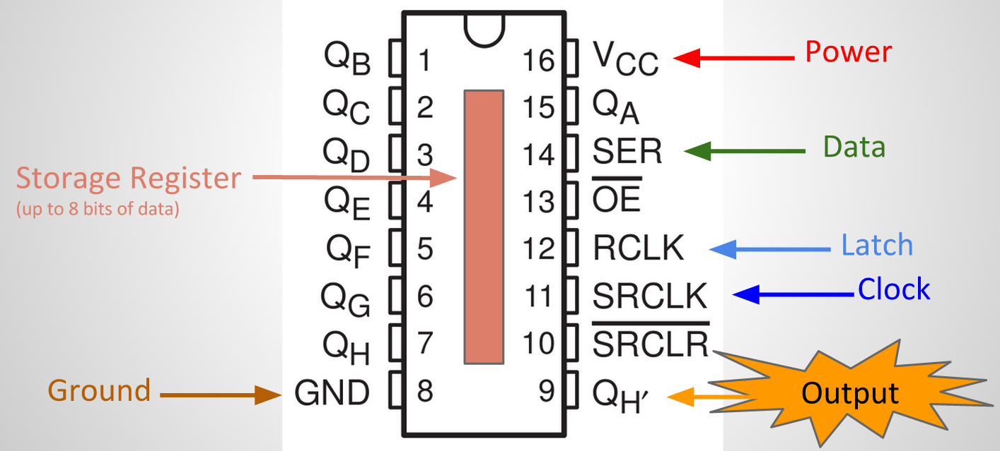

# Day 39 at Hacker School
## Three cool hardware-related things I've done this week

--------  
### I wired a cool circuit  

On my second day at Hacker School, I saw [this video](http://www.youtube.com/watch?v=6fVbJbNPrEU) on manually controlling a shift register. I wanted to wire a similar circuit myself, but didn't know enough about circuitry to follow the rather vague instructions in the [follow-up video](https://www.youtube.com/watch?v=oB_pz18AinI). Last week, I finally bought myself some [74HC595 shift registers](http://www.adafruit.com/products/450) and gave it a shot. (I also wrote about shift registers and how they work [last week](https://github.com/sophiadavis/Blog/blob/master/Day%20035%20--%20Shift%20Registers%20and%20a%20Nintendo.md), if you want more background.)  
	
Here is the pinout of the shift register chip I was working with:
 

The circuit presented in the YouTube clip uses 5 buttons -- one connected to each of the data, latch, clock, output enable (13), and clear (pin 10) pins. Each button is also wired to an LED such that when the button is pressed, the corresponding LED lights up -- a visual confirmation of the button-press (I'll refer to these as "button-press LEDs").  

Thinking I was helping myself out, I started with a simpler circuit. Notice that in the pinout above, the output enable and clear pins are shown with a line drawn over the top of the label. This line indicates that a pin is "active low", meaning that it is "off" when it is connected to ground, and "on" when power is flowing into the pin. That's backwards from how we usually think about electricity -- when I switch a lamp on, power flows into the lamp, and we see light. Since the "active low" thing kind of confused me, I left those buttons out, and instead wired the output enable and clear lines directly to power/ground, as shown in this (Arduino tutorial)[http://arduino.cc/en/tutorial/ShiftOut]. The second change I made was to leave out the four LEDs connected to the buttons. No LEDS were used in the Arduino tutorial, so I thought this omission would be fine. 

After fumbling with wires, resistors, and making other silly mistakes (note to self: always double check where the "top" of a pin is (indicated by the little half-circle on the pinout).), I had the Arduino example program working (counting from 0 to 255 in binary, using the 8 LEDS wired to the shift register output pins). But when I tried to add buttons to control the data, clock, and latch lines, nothing worked.  
	
Eventually I figured out my problem. It turns out that a pin doesn't have to be either "high" or "low". As explained [here](http://playground.arduino.cc/CommonTopics/PullUpDownResistor), "Just because you have nothing at all connected to an input pin doesn't mean it is a logical zero." In the circuit shown in the YouTube clip, the button-press LEDs serve to pull the data, clock, and latch pins *low* when the corresponding button is *not* pressed. I had left this out -- so when buttons in my circuit were *not* pressed, the pins were in some weird neutral state (not low and not high). This meant that the shift register chip was never registering a change from low to high. Once I added button-press LEDs to pull the data, clock, and latch low, everything worked.  
	
Here is a diagram of my final circuit (made with a cool tool called [Fritzing](http://fritzing.org/home/)):

And a picture:  

### I set up a new Raspberry Pi  
I've installed the necessary tools, got wifi working, and learned how to access the Pi remotely via SSH. I also installed
Elixir (many thanks to [this post](http://suranyami.com/post/80056047551/installing-elixir-on-raspberry-pi)). The next step was obviously to start a named node on the Pi (`iex --name node_name@ip_address --cookie some_secret_token`) and then spawn processes from my laptop to the Pi (`Node.spawn :"node_name@raspberry_pi_ip_address", fn -> IO.inspect System.cmd("ls", []) end`).

I'm not sure what I want to do with my Pi yet, but I'll probably start by remotely turning lights on-and-off. Something with Elixir could also be cool. Maybe distributed robots, like [these guys](http://www.isotope11.com/blog/distributed-robots-with-elixir).
 
### I successfully soldered something not-insubstantial, all by myself!  
When I bought the Raspberry Pi, I also ordered a ["Pi Cobbler"](http://www.adafruit.com/product/914), a device that provides a more convenient interface for accessing the Pi's GPIO pin deck. 

The GPIO pins on a Raspberry Pi are basically 40 indistinguishable metal pins:  

But they can't all be used as general purpose input and output -- you have to look carefully at the pinout (below) to know which pins do what:  

The Pi Cobbler makes the pins more accessible physically, and also helps you differentiate the pins without needing to refer to the pinout. One end of the Cobbler connects to the 40 GPIO pins on the Pi itself. The other end is a printed circuit board, with 40 pins -- each labelled with the function of the corresponding pin on the Pi. A "ribbon" connects every pin in the Pi's GPIO pin deck to the corresponding (labelled!) pin on the other side of the Pi Cobber. The pin deck on the printed circuit board side can then be plugged in to a breadboard -- providing super easy access to all GPIO pins.
  

The Pi Cobbler comes disassembled, so first I had to [solder all 80 connections)](https://learn.adafruit.com/adafruit-pi-cobbler-kit/solder-it). It works!