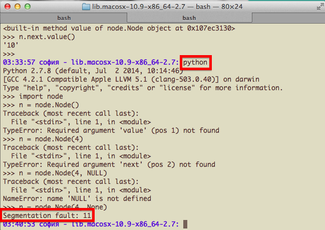
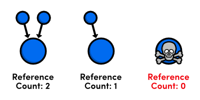

# Day 44 at Hacker School (my last day)
## C extensions for Python -- who knew reference counting was so important!

--------
I finally wrote a hashtable implementation in C -- it was on my "bucket list of things to do at Hacker School", along with playing with hardware and giving one last presentation. Hashtables are extremely useful data structures, as they enable you to store and access information in (basically) constant time. I knew coding an implementation myself would help me better understand how they work. Also, all data stuctures are more legit when implemented in C -- and a project was born.  

It only took me a couple of hours to write the code for a basic hashtable [(repo)](http://www.github.com/sophiadavis/hashtable) (see the README for a brief explanation of the data structure). When a friend suggested I write Python bindings to my program -- so that my data structure could be interacted with from Python, I thought that would be cool. I could let the user specify parameters for the hashtable, making it very easy to see how hash function, etc., affect performance in different use-cases. I also thought it would be trivial to do -- max a day-long project. One week later, I've learned a ton about the massive and knarly C program that is Python.

This is a screen shot of my first time segfaulting the Python interpreter:



--------

The process of writing a C extension for Python is very [well documented](https://docs.python.org/2/c-api/), and these tutorials were extremely helpful (I think [this one](http://starship.python.net/crew/arcege/extwriting/pyext.html) may just be an older version of [this one](https://docs.python.org/2/extending/extending.html), but I think has a bit more?). However I did have to deal with one aspect of Python I never expected to touch: reference counting.  

One reason that Python is such a nice language to use is that Python takes care of managing memory for the programmer. It does this by reference counting -- for any object, Python keeps track of the number of references currently pointing at that object. When this reference count drops to 0, Python knows it can safely clean up this object and reuse the memory in which it had been stored. Here's a picture:  



Now, when you're writing an extension for Python, YOU are in charge of increasing and decreasing the reference counts on all Python objects that you use.


This took me a long time to figure out, even after reading the [docs](www.docs.com) over and over and over. Python (via the `Python.h` header file) provides the tools for this: the magic words `Py_INCREF` and `Py_DECREF`. When you need to work with a Python object, you must tell Python that you're 'using' it by increasing the reference count (calling `Py_INCREF` on the pointer to the object). When finished, using `Py_DECREF` signals to Python that you're finished -- the reference count can be decreased. It's more complicated than it sounds because some functions (like `PyArg_ParseTupleAndKeywords`, which conveniently parses Python keyword arguments into typed C variables), actually just gives you a "borrowed" reference to the objects -- so if you Py_DECREF them, you're actually just going to screw stuff up.  

What do I mean by "screw stuff up"? Well, there are two types of mistakes that you can make.  

1. Not increasing the reference count when you need an object.
2. Not decreasing the reference count when you're done with an object.

In the first case, it's much more obvious what will go wrong. The reference count may drop to 0 while you are using an object. Python will step in and clean up the object, releasing the memory which it had been occupying. Any future attempts to use the object will cause a segfault. For example, in an earlier version of my program, the "set" method on a hashtable returned a new Python hashtable object, (in addition to updating the original object):

``` python
static HashTablePyObject *
HashTablePy_set(HashTablePyObject *self, PyObject *args)
{
    PyObject* key_input = NULL;
    PyObject* value_input = NULL;

    ## ...
    ## parse key/value types, handle errors, etc.
    ## ...

    # At first, I didn't have this:
    Py_INCREF(self);

    ## ...
    ## Update the hashtable
    ## ...

    return self;
}
```
I had forgotten to `Py_INCREF` this new object, so the reference count was 0. Python, thinking my hashtable object was no longer needed, kept cleaning it up very soon afterwards. At first, I had no idea why my program would randomly segfault, like so. When I put some printf's inside the functions I had provided to Python to deallocate and free my hashtable, I started to understand what was going on:

``` python
06:30:04 софия - lib.macosx-10.9-x86_64-2.7: python
Python 2.7.8 (default, Jul  2 2014, 10:14:46)
...
>>> import hashtable
>>> h = hashtable.HashTable()
>>> h.set("hello", "world")
...
>>> h.set("yo", "lo")
...
~~~~~~~~~~~~Dealloc-ing~~~~~~~~~~~~
~~~~~~~~~~~~Free-ing~~~~~~~~~~~~
>>> h.set("pi", 3.14159)
Python(1456,0x7fff7eac2310) malloc: *** error for object 0x7f9c29700060: pointer being freed was not allocated
*** set a breakpoint in malloc_error_break to debug
Abort trap: 6
```


I got to see this lovely pop-up quite often:  


--------


I also made several of the second kind of error: not decreasing the reference count on an object once I was finished using it.

In Python-The-C-Program, all objects are actually just structs. Here is the typedef for my Python hashtable object:  
``` c  
typedef struct {
    PyObject_HEAD
    HashTable *hashtable;
    long int size;
    long int load;
    double max_load;
    PyObject *hash_func;
} HashTablePyObject;

```

Notice that it contains a pointer to another PyObject -- the hash function used to calculate where each key-value pair should be stored (did you know C programs can call functions defined in Python? So cool!). Now, when defining a new Python type in C, you need to tell Python how to "clean up" instances of this class. You do this by providing Python with a 'deallocation' function to call when the object is no longer needed -- that function should take care of any Py_DECREF-ing of instance variables and free-ing that needs to happen. (note: the `PyObject_HEAD` thing in the above struct is actually a macro that expands to a [huge array of function pointers](https://github.com/sophiadavis/hash-table/blob/master/hashtablemodule.c#L220-261) defining functions like this one, the `repr` function, which function to use for comparison of instances of this class, etc.)

Here is my deallocation function:

``` c
static void
HashTablePyObject_dealloc(HashTablePyObject* self)
{
    Py_XDECREF(self->hash_func);
    if (self->hashtable != NULL) {
        self->ob_type->tp_free((PyObject*)self);
    }
}
```

Because each hashtable object contains a reference to another Python object, we need to remember to decrement the reference count on this object before the hashtable itself is cleaned up. (note: `Py_XDECREF` is the same as Py_DECREF, except it doesn't cause Python to segfault if its argument is a NULL pointer).


Here's a little program I wrote to demonstrate what happens with and without the `Py_XDECREF(self->hash_func)` line:

With `Py_XDECREF`:  
``` python
import hashtable
import sys

def main():
    print sys.getrefcount(hash) # current reference count of the built-in hash function
                                # ==> 3 (You can use the `get_referrers` method from the `gc` (garbage collection) module to find out what is referring to the given object, but I find the output very confusing. I think the 3 referrers might be globals()['__builtins__'], the current stack frame, and the sys.getrefcount() call itself. )
    do_hashtable_stuff(hash)
    print sys.getrefcount(hash) # ==> 3

def do_hashtable_stuff(hash_func):
    h = hashtable.HashTable()
    print sys.getrefcount(hash) # ==> 6
    h.set("hello", "world")
    h.get("hello")

if __name__ == "__main__":
    main()
```

Without:  
``` python
import hashtable
import sys

def main():
    print sys.getrefcount(hash) # ==> 3
    do_hashtable_stuff(hash)
    print sys.getrefcount(hash) # ==> 4 ####### OH NO!

def do_hashtable_stuff(hash_func):
    h = hashtable.HashTable()
    print sys.getrefcount(hash) # ==> 6
    h.set("hello", "world")
    h.get("hello")

if __name__ == "__main__":
    main()
```
See the difference? When we forget to decrease the reference count, it doesn't decrease (duh) after the hashtable object goes out of scope and is cleaned up. But now the hashtable has been cleaned up, there is no longer any way to remove that one reference from the hash function -- so, from now on, the reference count will *always* be greater than 0! Python will *always* think there is at least one thing that needs the hash function, and it will never be cleaned up. Now, it's obvious that in my example, this isn't a big deal. But this is still a memory leak. In a bigger or long-running program, this type of error could severly impact performance.  

This project gave me a huge appreciation for how complicated Python is, and it was awesome to peel back the layers and mess around with the internals for a bit. Otherwise ...


