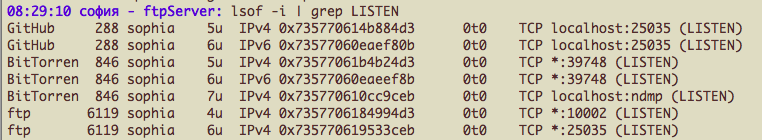
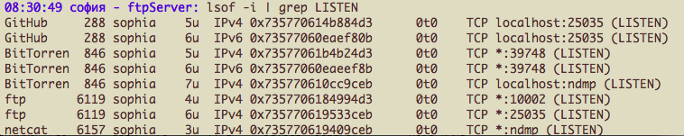
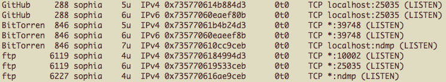
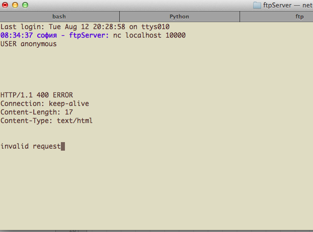
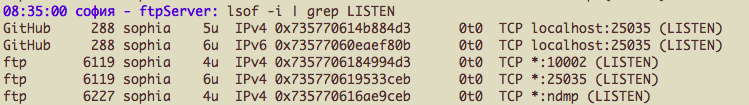
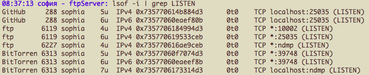
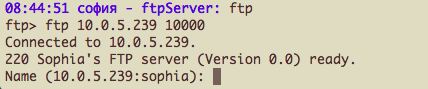

# Day 14 at Hacker School
## Lessons from the FTP server, part II.

-----

So...I've basically wrapped up my stint working on this FTP server. I'm hoping to move on to a Bittorrent client in Python, TDD style. That, unfortunately, didn't get very far today ('Oh, I'll just use Regex to parse bencoding! I love Regex! What a great idea!' Enter hours of rabbit hole and 0 progress... so sad.)

But reviewing the security of my server program with Max turned out to be even more interesting than I had imagined, so the day was not *all* wasted.

________

With the goal of exploiting some sort of security vulnerabilities in my code, the first thing we looked at was how I dealt with buffers. If data was ever copied from a client into a buffer without first verifying that the data would actually fit into the given buffer, my program would potentially have been vulnerable to memory corruption. The 'extra' data would just be copied in to adjacent memory, which might overwrite important information. Thankfully, I had been pretty careful to use only the 'memory safe' versions of C's string manipulation functions (like [snprintf](http://linux.die.net/man/3/snprintf) and [friends](http://beej.us/guide/bgc/output/html/multipage/index.html) -- they usually have an 'n' in the name), which allow you to set the max available size of the buffer. C's socket send and receive functions also allow you to take buffer size in to account. There weren't any glaring security vulnerabilities here.

________

We also looked at how chroot-ing a process works. It does prevent authorization bugs by keeping clients from navigating all over my computer directory system (plus I didn't implement file uploads or even require the use of a password, so there wouldn't be much such a client *could* do). However, Max pointed out that since I need to run the program with sudo, the process itself now has sudo priviledges. The way I understood this was if someone did manage to highjack my program, they might be able to use it to do really bad stuff that no one except root users should be able to do... so that could be bad.

________

And what if a client could somehow just crash my server, maybe by feeding it input that I hadn't handled and causing it to segfault some how? That would be an example of a denial of service attack. They're not harming me or my computer directly, but they're keeping my server from doing it's job. If my service were a program that real people were actually relying on, they'd be out of luck. They'd also probably stop using my program, which would be a bummer, especially if I wanted to make money from said users.   

In terms of my program, one thing we found was the variables bytes_sent and total_bytes_sent, which I had declared to have type integer. I had just wanted to see how many bits of data were actually transmitted to a given client. These variables weren't used for anything except I printed them out every time a client closed the connection. Since I'm working with file transfers, though, this total_bytes_sent number could get pretty big -- possibly bigger than the maximum value of an integer on my operating system. We looked at MAX_INT -- [2147483647, "the maximum value for a 32-bit signed integer"](http://en.wikipedia.org/wiki/2147483647). That's only about 268.435455875 Megabytes -- not *that* big. If a client ever received more than that much data from my server, the integer would [overflow](http://en.wikipedia.org/wiki/Integer_overflow): the value would wrap back around to -2147483648. If my program were relying on this being a positive number or otherwise using this to control something, I would be screwed. 

________

Later in the day, Max said he had found another bug in my code. My server always starts on port 5000, and every time a new socket is opened to transmit data to the client, I simply open that socket on the next highest port. I hadn't seen a problem with this -- there are so many ports, and my server was only ever dealing with a max of 5 or 6 clients. But what would happen if  tried to make a socket listen on a higher port? There are only 65535 ports, after all. Max and I wrote a Python script in which a client would interact with the server long enough to issue a 'Passive' command, connect on the second port, and receive a directory listing over that data connection -- repeated 70000 times. Max showed me [Netcat](http://en.wikipedia.org/wiki/Netcat), which we used to figure out exactly how to structure our attack to keep the server from blocking. In the meantime, we learned that you can only have 255 sockets open (oops -- there was one I was forgetting to close). We then discovered that our Python client and the server ceased communicating when we reached port 10000. Strange. We could open a connection on port 10000 with Netcat, but we couldn't talk to the FTP server. So we started the server on port 10002. (btw, ndmp is some sort of network nickname for port 10000 (??) -- a firewall usually runs there (??), but we were dealing with traffic on my own computer, so this wasn't the issue.) 

Here were the processes listening on my machine ([lsof](http://www.thegeekstuff.com/2012/08/lsof-command-examples/) looks like a pretty cool tool):   
________ 

  
 
FTP server running on 10002, with Python FTP client stalled on port 25035.  

________

  

FTP server running on 10002, with Python client stalled on port 25035. Netcat could still listen on port 10000.  

________

  

I started my FTP server on port 10000 (ndmp) again -- it's running, but we couldn't get Netcat or the Python client to connect to it!  

________

  

Here's what happened when we tried to connect using Netcat. Strangely, we get an HTTP response! Going to localhost:10000 in the browser also yielded an "invalid request" message on the screen. Something was happening on port 10000, but it wasn't my FTP server (which was also running). Something was stealing traffic over this port from my server! Tom Ballinger suggested the culprit was my Mac's bittorrent client app.  

________

  
... so I closed it. And the Python FTP client and Netcat could suddenly connect to the FTP server, on port 10000. Weird.  

________

  
Even weirder: when we started the bittorrent app again -- WHILE my server was still running -- all of a sudden we couldn't connect to my server anymore!  

________

  
Mystery solved: see the \*'s next to some of the port numbers? That indicates that the file is listening on all interfaces. So bittorrent is listening on *all* interfaces on port 39748, but it's also listening on *localhost* on the trouble-port, port 10000. The hypothesis is that because my FTP server is listening on *all* interfaces on port 10000, when the bittorrent client requests to listen only localhost, it somehow gets priority. All requests over that port suddenly are rerouted to it. Weird. 

________

When I increased the starting port to 10002, the same stalling behaviour occured when we reached port 25035 -- apparently being used by my GitHub app. Hopefully we can explore this more tomorrow, and see what would happen when we get past port 65535 (I guess we could just launch the server on port 65535, but that would be boring).
